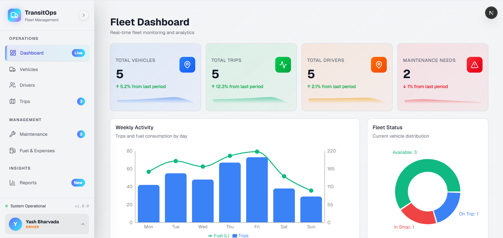
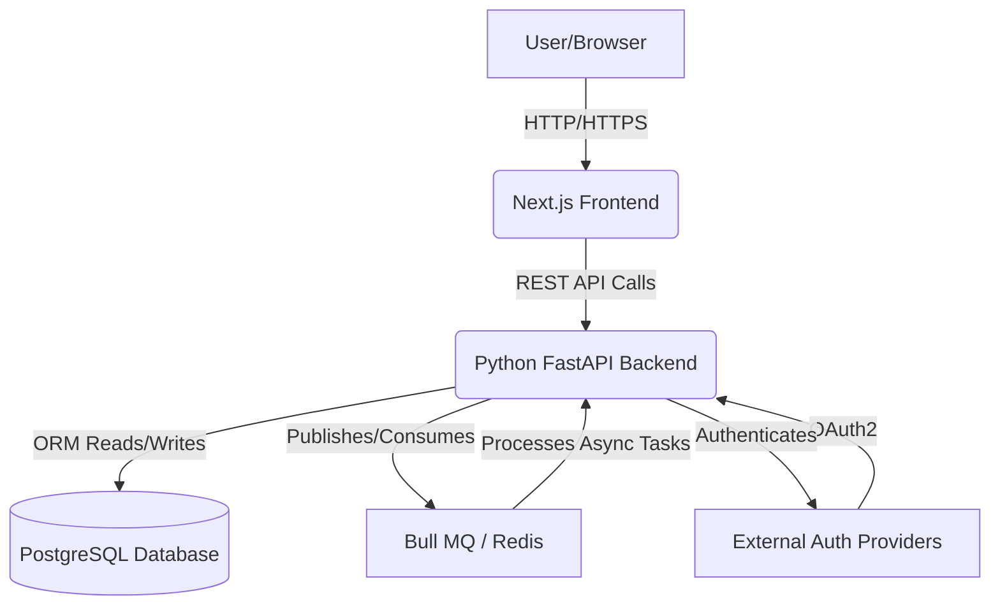
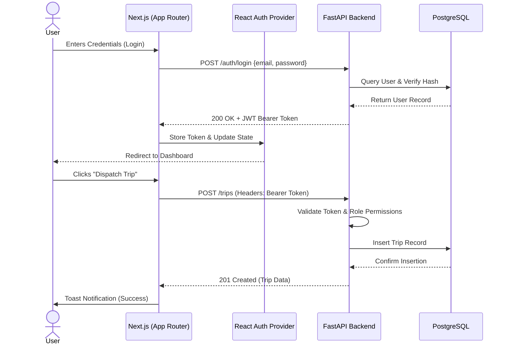

<div align="center">
  
# 🚚 TransitOps 
### The Ultra-Premium Fleet Operations & Management Platform

[](https://nextjs.org/)
[](https://react.dev/)
[](https://fastapi.tiangolo.com/)
[](https://tailwindcss.com/)
[](https://postgresql.org/)

TransitOps is a next-generation, full-stack fleet operations platform engineered to completely streamline vehicle tracking, driver management, maintenance scheduling, and expense logging. Built with cutting-edge web technologies, it offers a beautifully designed, highly responsive, and robust enterprise experience.

---

</div>

## 📸 Platform Showcase

<div align="center">
  
  
  
</div>

---

## ✨ Core Features

TransitOps brings enterprise-grade fleet management capabilities wrapped in an award-winning UI:

- 🎨 **Ultra-Premium UI/UX:** A stunning, responsive interface featuring glassmorphism, dynamic micro-animations, a highly functional collapsible sidebar, and an integrated system-wide Dark Mode.
- 🔐 **Role-Based Access Control (RBAC):** Bank-grade JWT authentication with distinct clearance levels (`Admin`, `Manager`, `Driver`, `Viewer`) tightly controlling CRUD actions and module visibility across the frontend and backend.
- 📈 **Dynamic Dashboard:** Get a bird's-eye view of your entire operation with real-time aggregates—active trips, available vehicles, pending maintenance, and financial metrics displayed through real-time mini-charts.
- 🚛 **Advanced Vehicle Management:** Complete asset lifecycle tracking. Monitor operational status, total mileage, and detailed specifications.
- 👥 **Driver Intelligence:** Manage driver schedules, track dynamic safety scores, and easily report incidents that instantly affect driver ratings.
- 📍 **Trip Dispatch & Tracking:** Seamlessly dispatch active trips, assign vehicles/drivers, log start/end locations, and record real-world completion data.
- 🔧 **Proactive Maintenance:** Schedule preventive maintenance, log mechanical repair costs, and mark critical tasks as resolved before they cause fleet downtime.
- ⛽ **Financial & Expense Logging:** Comprehensive ledger for logging fuel consumption, operational tolls, and tracking overall fleet efficiency.
- 📊 **Insights & Reporting:** Deep visual analytics powered by `Recharts` to present fleet utilization, granular cost breakdowns, and historical performance over time.

---

## 🛠️ Technology Stack

We believe in using the absolute best tools for the job. TransitOps leverages a modern, scalable, and type-safe architecture:

### Frontend
- **Framework:** Next.js 15 (App Router) & React 19
- **Styling:** Tailwind CSS v4 alongside custom CSS variables for rich, dark-mode-first theming.
- **Component Architecture:** Radix UI primitives with a highly customized, Shadcn UI-inspired design system.
- **Data Visualization & Assets:** Recharts for analytics, Lucide React for crisp iconography.
- **State Management:** Highly decoupled React Context API (`useAuth`, `useDashboard`) working in tandem with the Next.js router.
- **Notifications:** Sonner (for beautiful, toast-based alert systems).

### Backend
- **Framework:** FastAPI (Python 3) - High performance, highly concurrent REST framework.
- **Database & ORM:** PostgreSQL / SQLite handled natively via SQLAlchemy 2.0.
- **Data Validation:** Pydantic (Strict typing and request schema validation).
- **Security:** OAuth2 with JWT (JSON Web Tokens) and Passlib password hashing.
- **CORS & Middleware:** Hardened FastAPI CORSMiddleware.

---

## 🏗️ Architecture & Data Workflow

Our architecture is designed for speed, asynchronous task handling, and immediate feedback:



1. **Client Layer:** Next.js serves static/dynamic UI and hydration payloads.
2. **Gateway:** FastAPI securely routes requests, validating all I/O via Pydantic.
3. **Persistence:** SQLAlchemy securely queries the PostgreSQL layer.
4. **Asynchronous Jobs (Redis):** Heavy lifting (like report generation or batch notifications) is offloaded to queues.

### System Flow & Authentication Lifecycle

Below is a detailed sequence diagram showing a typical user journey (Login -> Accessing secure resources -> Logging out):



---

## 📂 Project Structure

```text
transit-ops/
├── backend/                  # FastAPI Application
│   ├── app/
│   │   ├── api/routes/       # REST Endpoints (Vehicles, Trips, Drivers, etc.)
│   │   ├── models/           # SQLAlchemy DB Models
│   │   ├── schemas/          # Pydantic Validation Schemas
│   │   └── main.py           # Application Entrypoint
│   └── requirements.txt      # Python Dependencies
│
├── frontend/                 # Next.js Application
│   ├── app/                  # App Router (Pages & Layouts)
│   ├── components/           # Reusable UI Components (Sidebar, Cards, etc.)
│   ├── lib/                  # Utilities & API Client Axios config
│   └── public/               # Static Assets
│
├── API.md                    # Detailed REST API Documentation
└── README.md                 # You are here
```

---

## 🚀 Getting Started

Want to run TransitOps locally? Follow these steps.

### Prerequisites
- Node.js 18+ (for Frontend)
- Python 3.10+ (for Backend)

### 1. Backend Setup
1. Navigate to the `backend` directory.
2. Create an isolated virtual environment: 
   ```bash
   python -m venv venv
   ```
3. Activate the environment:
   - **Windows:** `venv\Scripts\activate`
   - **Unix/MacOS:** `source venv/bin/activate`
4. Install all python dependencies: 
   ```bash
   pip install -r requirements.txt
   ```
5. Spin up the ASGI server: 
   ```bash
   uvicorn app.main:app --reload
   ```
   *✨ The API will now be live at http://localhost:8000*

### 2. Frontend Setup
1. Open a new terminal and navigate to the `frontend` directory.
2. Install the necessary node modules: 
   ```bash
   npm install
   ```
3. Boot up the Next.js development server: 
   ```bash
   npm run dev
   ```
   *✨ The web interface will now be live at http://localhost:3000*

---

## 📚 API Reference Documentation

We maintain comprehensive documentation for all backend endpoints. For full details on our REST implementation (including payload schemas and exact role permissions), please refer to the **[API.md](API.md)** document located in the root of the project. 

> **Developer Tip:** Because TransitOps utilizes FastAPI, an interactive, auto-generated Swagger UI is immediately available. Simply run the backend and visit `http://localhost:8000/docs` to test endpoints and explore the API surface in real-time.

---

<div align="center">
  <p>Built with ❤️ by the TransitOps Team</p>
</div>
